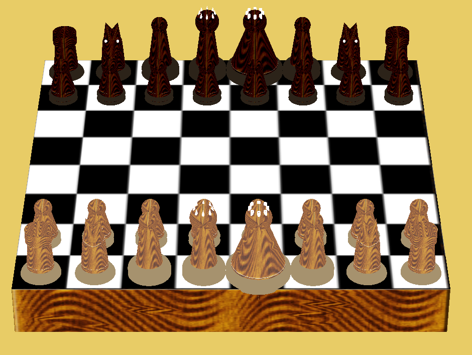

# 3D-Chess-Game-Computer-graphics
This is a 3d interactive 2 player chess game developed as a project for my computer graphics course. It allows two players to play a full game of chess against each other on the same device.

This project was made by:
Arun Hiremath
Anusha Ajagond
Amay Halemani
